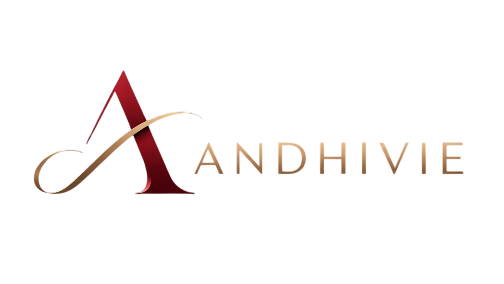

<p align="center">
  
  <br>
  <div align="center">
    
    
  </div>
</p>

## 🧩 What is Andhivie?

**Andhivie** is a self-hosted, interactive quiz and learning platform designed for education — from elementary school through college — and comfortable for training, events, and community learning.

Built with an **elegant dark** aesthetic, Andhivie combines the energy of live quiz games with the flexibility of self-paced learning and team-based competition. It gives teachers rich authoring tools, real-time insight into student progress, and delightful experiences for learners through reactive avatars.

> **Status:** Active development. Core flows (join, lobby, live quiz, results) are functional. Advanced features (student-paced mode, team mode, anti-cheating) are in progress.

## ✨ Vision

To be the **premium-feeling** self-hosted learning platform — easy for teachers, joyful for students, and useful for real classroom decisions.

## 🎯 Planned Features

### Session Modes
- **Teacher-Led** — the host controls the pace, everyone sees the same question
- **Student-Paced** — students advance at their own speed *(in progress)*
- **Team Mode** — combined team scores and team leaderboards *(in progress)*

### Question Types
- Multiple Choice (2–8 options)
- Multi-Select
- True / False
- Fill in the Blank
- Matching, Ordering, Hotspot *(planned)*
- Open-ended with AI grading *(planned)*

### Authoring & Management
- Rich Question Editor with media (image, video, audio)
- Quiz Library with folders and tags
- Import from Excel / Word / PDF *(planned)*
- Export to Excel & PDF with watermark

### Host Controls
- Simple login for hosts/admins
- Live progress dashboard
- Per-student accommodations
- Review mode after a quiz
- Scheduled assignments

### Anti-Cheating (Moderate)
- Tab-switch detection
- Question & option shuffling
- Optional force-fullscreen per session
- Copy-paste & right-click blocking

### Engagement
- Real-time leaderboards
- Streak reactions
- Lightweight power-ups (Shield, 50/50, Freeze, Double Points)
- Reactive avatar (Rive)

## 🛠️ Tech Stack

| Layer | Technology |
|-------|------------|
| **Frontend** | React 19 + TypeScript + Tailwind CSS v4 + Vite |
| **Routing** | TanStack Router |
| **State** | Zustand |
| **Backend** | Node.js + Socket.IO |
| **Validation** | Zod |
| **Animation** | Motion + Rive |
| **Monorepo** | pnpm workspaces |

## 🎨 Brand

| | |
|---|---|
| **Primary** | Deep Crimson `#E11D48` |
| **Accent** | Champagne Gold `#D4A883` |
| **Background** | Deep Charcoal `#0F0A0A` |
| **Heading Font** | Outfit |
| **Body Font** | Plus Jakarta Sans |
| **UI Language** | English |

## 🚀 Getting Started

### Prerequisites

Choose one:

- **Docker:** Docker + Docker Compose
- **Manual:** Node.js 24+, pnpm 10.16+

### 🐳 Using Docker (Recommended)

```bash
docker compose up -d
